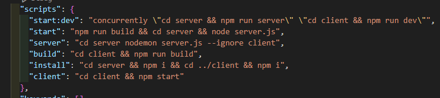
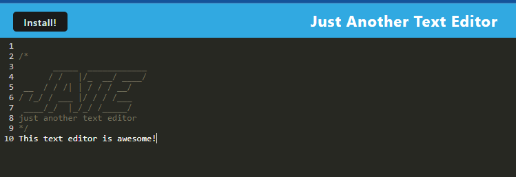

# PWA Text Editor

## Description

Welcome to the PWA Text Editor! This is a Progressive Web Application Text Editor that allows you to save and edit some important text you want to have installed. Yes, you read well the app can be installed! Thanks to manifest.json and to webpack the application can be functional without internet and has implemented a database called indexedDb which keeps track of the files that are being displayed in the editor, asside of that, it has a service worker implemented that caches all the necessary files and images for the application to be functional when there is no connection. The code is bundled thanks to Webpack and transpiled thanks to Babel. It also has a button that makes it easier for the users to install the application, once the user clicks install a new direct access will be created and will make the application easier to acces to the user. It also uses the npm concurrently dependencie, that allows to run different commands since our folder structure has the server and the client in differente folder structures. 

## Installation 

To install the app you would have to clone the repository to your local machine and run `npm install`  to install all the used npm dependencies. Once you have installed all the dependencies, inside the terminal type `npm start`. This will run the webpack.config.js file that will create the dist folder that eventually will make the app run. 

Don't wanna do that? No problem, just visit the link below!

[Deployed app](https://polar-castle-66412-3739f67f3142.herokuapp.com/)

## Usage

You want to save some text that is important? 
No problem, just use JATE, start typing and your text will be saved inside the application, whether or not you have internet connection, this is thanks mainly to Webpack!

## Licence

This repository is licenced under the MIT licence.

## Questions

Have any question? 
Contact me: jonathan.cobos@outlook.es 

